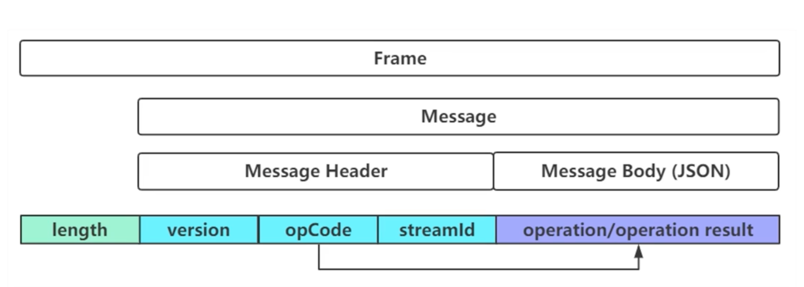

# netty-in-action
[Netty源码剖析与实战](https://time.geekbang.org/course/intro/237) 实战项目代码。

[Netty源码剖析与实战 课程PPT&代码](https://github.com/jiafu1115/geek_netty)

## Requirements
* JDK 1.8+
* Maven 3.2

## 协议封装
数据结构如下:

